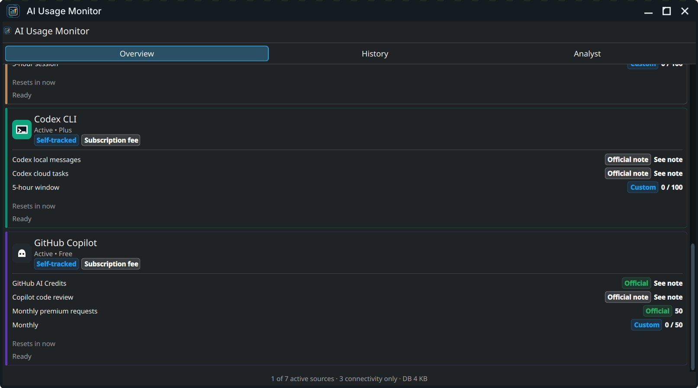
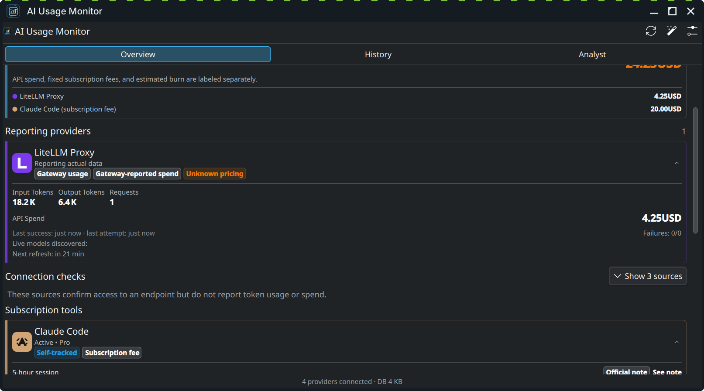
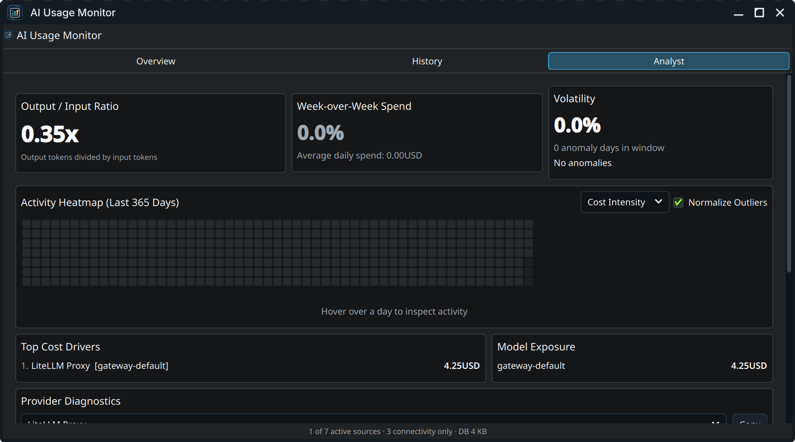
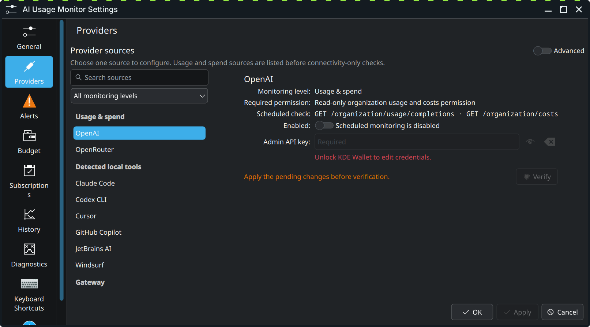

# AI Usage Monitor for KDE Plasma 6

  

AI Usage Monitor puts AI provider usage, spend, limits, and local coding-tool activity in your Plasma panel. It stores API keys in KWallet and keeps history on your computer.

The current stable release is **13.0.0 (Provider Intelligence)**. Scheduled provider checks are read-only. A provider that cannot report usage or billing stays marked as unknown instead of showing a false zero.

## Install on Fedora

The COPR package is the supported Fedora installation. It includes both the Plasma widget and the compiled Qt plugin.

~~~bash
sudo dnf copr enable loofitheboss/plasma-ai-usage-monitor
sudo dnf install plasma-ai-usage-monitor
~~~

Log out and back in after the first install. Then:

1. Right-click the panel or desktop and choose **Add Widgets**.
2. Search for **AI Usage Monitor**.
3. Add it to the panel or desktop.
4. Right-click the widget and choose **Configure AI Usage Monitor**.

To update later:

~~~bash
sudo dnf upgrade plasma-ai-usage-monitor
~~~

For source builds and other installation details, read the [installation guide](docs/user-guide/installation.md).

## Start here

- [Install or update the widget](docs/user-guide/installation.md)
- [Complete the first setup](docs/user-guide/getting-started.md)
- [Understand actual, estimated, and unavailable values](docs/user-guide/understanding-data.md)
- [Configure API providers](docs/user-guide/providers.md)
- [Track subscription tools and Browser Sync Labs](docs/user-guide/subscriptions.md)
- [Use history, exports, Prometheus, and webhooks](docs/user-guide/history-and-integrations.md)
- [Fix common problems](docs/user-guide/troubleshooting.md)
- [Review privacy and security behavior](docs/user-guide/privacy-and-security.md)

The [GitHub wiki](https://github.com/loofiboss-bit/plasma-ai-usage-monitor/wiki) provides the same task-based entry points for people who prefer GitHub's wiki navigation.

## What it monitors

AI Usage Monitor supports 18 providers:

- OpenAI, Anthropic, Google Gemini, DeepSeek, OpenRouter, and Google Veo
- Mistral AI, Groq, xAI, Ollama Cloud, Together AI, and Cohere
- Azure OpenAI, AWS Bedrock, LiteLLM Proxy, Cerebras, Fireworks AI, and Perplexity

Providers expose different data. OpenAI can report account usage and spend with an Admin API key. OpenRouter can report key usage. LiteLLM can report gateway spend. Many other providers only expose model discovery or account connectivity. The widget labels those differences and does not turn connectivity into invented usage data.

The generated [provider capability matrix](docs/provider-capabilities.md) lists the scheduled endpoint and monitoring level for every provider.

The widget also tracks Claude Code, Codex CLI, GitHub Copilot, Cursor, Windsurf, and JetBrains AI. Local activity and configured plan limits are estimates unless a supported authenticated source provides a live quota window.

## Main features

- Provider usage, spend, balances, limits, and connection state where the provider exposes them
- Local history with single-provider and comparison views
- Analyst view with spend trends, activity heatmap, anomalies, and top drivers
- Daily and monthly budget warnings
- KDE notifications plus optional Slack and Discord webhooks
- Scheduled JSON or CSV exports
- A loopback-only Prometheus endpoint
- Configuration export that excludes keys, tokens, cookies, and webhook URLs
- Diagnostics for KWallet, provider health, catalogs, browser profiles, and the loaded plugin
- No telemetry or hosted backend

## Data boundaries

Scheduled provider refreshes do not run inference requests. Explicit inference tests are labeled in the widget and may consume provider quota or money.

Secrets stay in KWallet. Usage history stays in a local SQLite database. Browser Sync Labs is off by default and uses undocumented service endpoints that can change without notice.

Read [Understanding the data](docs/user-guide/understanding-data.md) before setting budgets or treating a provider card as a billing record.

## Screenshots

| View | Screenshot |
| --- | --- |
| Provider intelligence |  |
| Analyst |  |
| Settings |  |

## Distribution notes

- **Fedora COPR:** supported and recommended. Includes the widget and compiled plugin.
- **Source build:** supported. Builds the same two parts.
- **KDE Store plasmoid:** frontend-only. It needs a matching compiled plugin from COPR or a source build.
- **Flatpak:** not supported because the native QML plugin is not packaged by the old scaffold.

## Development

The project uses C++20, Qt 6, KDE Frameworks 6, QML, CMake, and a repo-owned Justfile.

~~~bash
git clone https://github.com/loofiboss-bit/plasma-ai-usage-monitor.git
cd plasma-ai-usage-monitor
just doctor
just build-debug
just test
just check
~~~

Use `just dev` for QML-only changes. Use `just install`, `just reload`, and `just smoke` when the compiled plugin changes.

Contributor setup, architecture, code conventions, and release checks live in [CONTRIBUTING.md](CONTRIBUTING.md).

## Project documents

| Document | Purpose |
| --- | --- |
| [User guide](docs/user-guide/README.md) | Task-based help for installation, setup, daily use, and troubleshooting |
| [Provider capabilities](docs/provider-capabilities.md) | Generated provider monitoring contract |
| [Architecture](docs/architecture/reliability-core.md) | Runtime, data, secret, and distribution boundaries |
| [Changelog](CHANGELOG.md) | Release history |
| [Roadmap](ROADMAP.md) | Current product direction and next work |
| [Security policy](SECURITY.md) | Vulnerability reporting and supported releases |
| [Contributing](CONTRIBUTING.md) | Developer workflow and contribution rules |

## Support

For a bug, open a [GitHub issue](https://github.com/loofiboss-bit/plasma-ai-usage-monitor/issues) and include:

- Plasma version from **plasmashell --version**
- Linux distribution and version
- installed widget version from **rpm -q plasma-ai-usage-monitor** on Fedora
- steps to reproduce
- the redacted support report from **Settings → Diagnostics**

Report security problems privately through [GitHub Security Advisories](https://github.com/loofiboss-bit/plasma-ai-usage-monitor/security/advisories/new).

## License

GPL-3.0-or-later. See [LICENSE](LICENSE).
