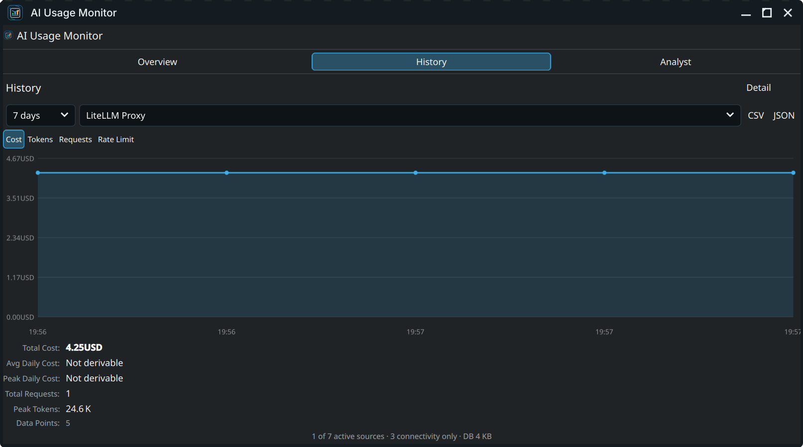

# App User Guide

This guide describes the user interface of **AI Usage Monitor**, explaining the data indicators, layout structure, interactive charts, and settings options.

---

## 1. Compact Panel Representation

The widget sits in your Plasma panel as a compact icon. It supports three user-configurable display modes:

1. **Icon with Status Badge**: A custom AI logo with a color-coded notification badge (Green for normal, Yellow for warning thresholds, Red for critical/exceeded limits).
2. **Current Total Spend**: Displays your total cumulative monthly spend directly in the panel (e.g., `$12.45`).
3. **Active Provider Count**: Shows the number of currently enabled and reporting sources.

---

## 2. Main Window (Expanded Popup)

Clicking the panel icon opens the main dashboard popup. The header displays an aggregated cost summary and counts of actual reported data, estimates, balances, and connection checks.

The main window is split into three primary tabs: **Overview**, **History**, and **Analyst**.

### A. The Overview Tab
The Overview tab lists your configured sources grouped by their data quality:

* **Reporting Providers**: Sources that report active token usage, costs, or quotas.
* **Local Coding Tools**: Subscription coding helpers like Claude Code or Copilot, showing estimated usage progress against their plan limits.
* **Connection Checks** (Collapsed by default): Providers that only verify credential connectivity without reporting token usage.
* **Configuration / Recovery Actions**: Displays warnings or buttons for sources that need attention (e.g., KWallet locked, invalid API keys).

#### Collapsible Provider Cards
Each source is rendered inside a card showing its connection status, token usage, real/estimated cost, rate limits, and budget progress.

* **Status Indicators**: Connected (green dot), Stale (yellow dot), Error (red dot).
* **Limit Bars**: Double-layered progress bars for rate limits or tokens remaining (configured with warning/critical threshold colors).
* **Source Quality Badges**: Labels showing the data origin (e.g., `Actual API usage`, `Estimated pricing`, `Response headers`).

---

## 3. History Tab

If history logging is enabled, the **History** tab displays interactive charts showing usage trends over time (24h, 7d, or 30d).

* **Detail Mode**: Displays cost, token, request count, or rate limit trends for a single selected provider with an overlay trend line.
* **Compare Mode**: Overlays multiple compatible provider curves on a single chart to rank and compare your top cost drivers.
* **Unit Safety**: Comparison charts only permit overlaying sources with compatible metrics (e.g., comparing USD spend vs. USD spend, not mixing USD and EUR, or token counts with dollars).

---

## 4. Analyst Tab

The **Analyst** tab provides an advanced breakdown of your AI consumption habits, highlighting key trends and potential anomalies.

* **Spend Trends & Volatility**: Calculated average daily spends, peak spending spikes, and percentage changes.
* **Activity Heatmap**: A visual grid highlighting which days of the week or hours of the day generate the most API requests.
* **Anomalies**: Automatically flags unusual usage spikes or sudden increases in token usage that differ from your baseline averages.

---

## 5. Configuration Settings

Right-click the widget and select **Configure AI Usage Monitor...** to open the multi-tab settings window.

The settings pane is structured into 6 tabs:
1. **General**: Global refresh intervals, compact panel display modes, and per-provider overrides.
2. **Providers**: Enable/disable APIs, manage API keys, override model settings, and configure custom base URLs.
3. **Alerts**: Enable warning/critical notification thresholds, scheduled cooldown windows, and Do Not Disturb (DND) periods.
4. **Budget**: Set monthly and daily dollar caps per provider.
5. **Subscriptions**: Configure plan limits, filesystems to watch, and Browser Sync for Claude Code, Codex CLI, and GitHub Copilot.
6. **History**: Toggle database logging, set retention periods, manage SQLite database size, and export JSON/CSV records.
