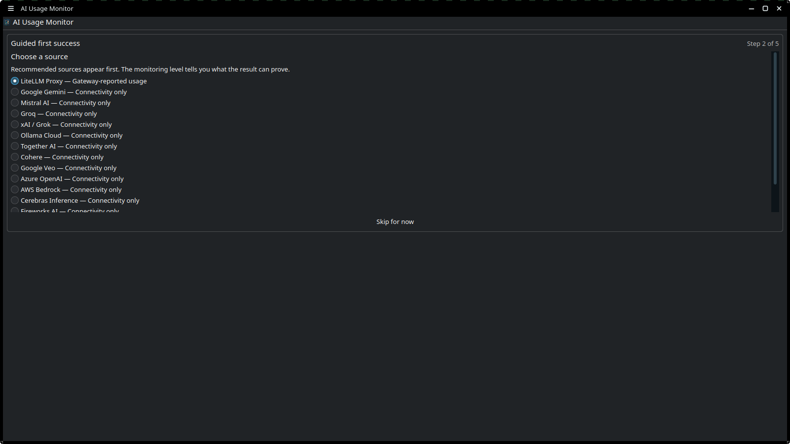
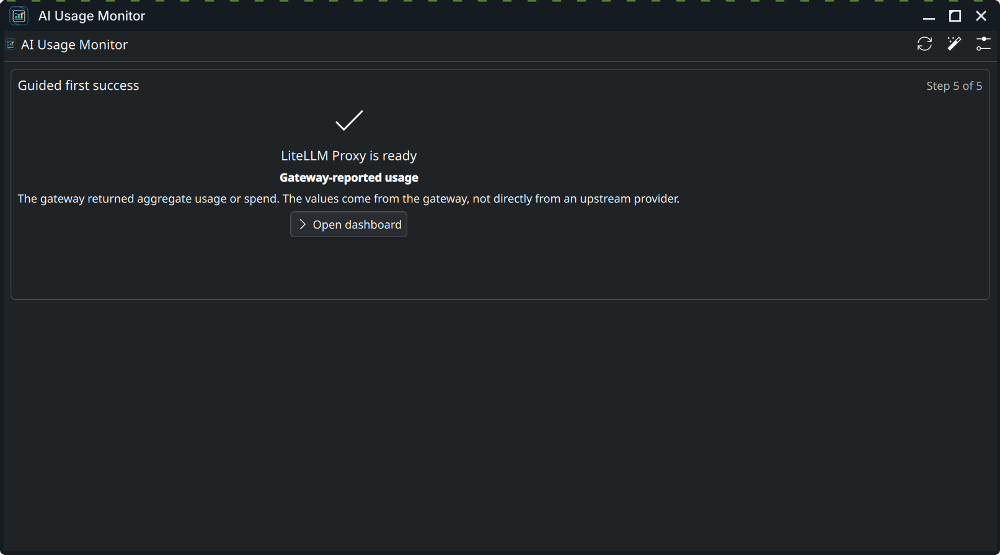

# Getting Started

Follow this guide to install, add, and complete the first setup for **AI Usage Monitor**.

---

## 1. Installation

AI Usage Monitor requires two parts to work:
1. A QML Plasma 6 frontend (widget).
2. A matching compiled C++ Qt plugin (`com.github.loofi.aiusagemonitor` QML module).

> [!IMPORTANT]
> The KDE Store package only installs the frontend. We highly recommend using the Fedora COPR package or the guided bootstrap script to install both parts automatically.

### Option A: Fedora COPR (Recommended)
On Fedora KDE, run the following commands to install the pre-packaged build:

```bash
sudo dnf copr enable loofitheboss/plasma-ai-usage-monitor
sudo dnf install plasma-ai-usage-monitor
```

After installation, **log out and log back in** (or reload Plasma) to let the QML engine detect the new plugin.

To upgrade in the future:
```bash
sudo dnf upgrade plasma-ai-usage-monitor
```

---

### Option B: Guided Source Install
If you are not on Fedora or prefer compiling from source, use the repository's bootstrap script. It will check prerequisites, compile the C++ plugin, and install the plasmoid:

```bash
git clone https://github.com/loofiboss-bit/plasma-ai-usage-monitor.git
cd plasma-ai-usage-monitor
./scripts/install_bootstrap.sh
```

On Fedora systems, you can automatically install missing development dependencies with:
```bash
./scripts/install_bootstrap.sh --method source --install-missing
```

---

### Option C: Manual Compilation
You can compile and install the C++ plugin manually using CMake:

```bash
cmake -S . -B build -DCMAKE_BUILD_TYPE=Release -DCMAKE_INSTALL_PREFIX=/usr
cmake --build build --parallel
sudo cmake --install build
./scripts/reload_plasma.sh
```

---

## 2. Add the Widget to Your Desktop/Panel

1. Right-click your KDE Plasma desktop or panel.
2. Select **Add Widgets...** (or press `Meta+A`).
3. Search for **AI Usage Monitor**.
4. Drag and drop it onto your panel or desktop.
5. Click on the widget icon. It will detect a fresh installation and start the **Guided first success** onboarding workflow.

---

## 3. Complete Guided First Success

The widget uses a guided checklist to help you configure and verify your first monitoring source successfully.



1. **Choose a Source**: Select the first provider or local tool you wish to track. The wizard highlights which sources report actual spending/usage data vs. those that only verify connectivity.
2. **Review Monitoring Level**: Read the monitoring level explanation (e.g., "Actual usage and spend" vs. "Connectivity only").
3. **Configure Credentials**: Enter the API key, project details, or custom URLs.
4. **Save and Verify**: Click **Save and verify**. The widget will encrypt the keys into your local **KWallet** storage and run a read-only request to verify that the credentials are correct.
5. **Review Success**: Ensure the connection test passes. The widget will mark the source as active with its associated data quality label.



---

## 4. Run Diagnostics Check

Once your first source is working, right-click the widget, select **Configure AI Usage Monitor...**, and go to the **Diagnostics** tab to verify that the runtime layers are fully synchronized:

* **Version Sync**: Confirm that the frontend QML and native C++ plugin versions match exactly.
* **Install Layers**: Verify that the widget files are loaded from the correct location.
* **History DB**: Confirm the SQLite database is healthy.
* **KWallet & Catalogs**: Verify that KWallet is connected and localization catalogs are loaded.

If you encounter any mismatched versions or missing plugin errors, refer to the [Troubleshooting & FAQ](./Troubleshooting-and-FAQ.md) guide.

---

## 5. Next Steps
Once your first source is up and running, you can:
* Configure additional providers in **Settings → Providers**.
* Set spending budgets in **Settings → Budget**.
* Configure desktop alert thresholds in **Settings → Alerts**.
* Enable local usage history logging in **Settings → History**.
